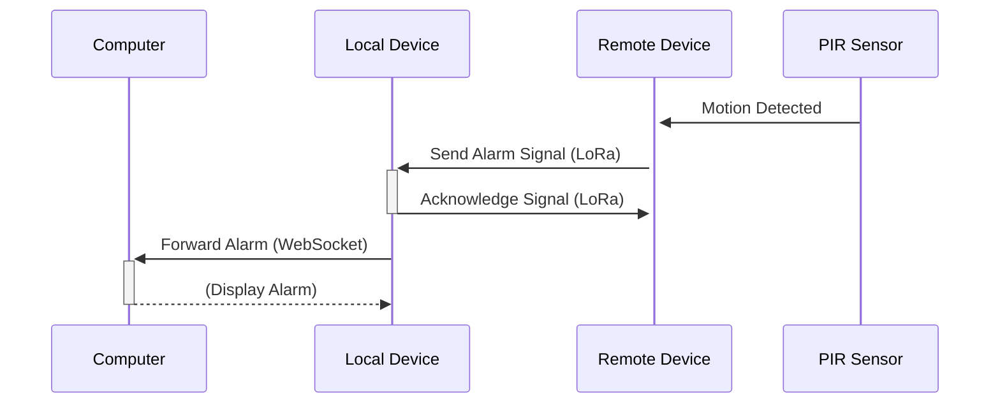
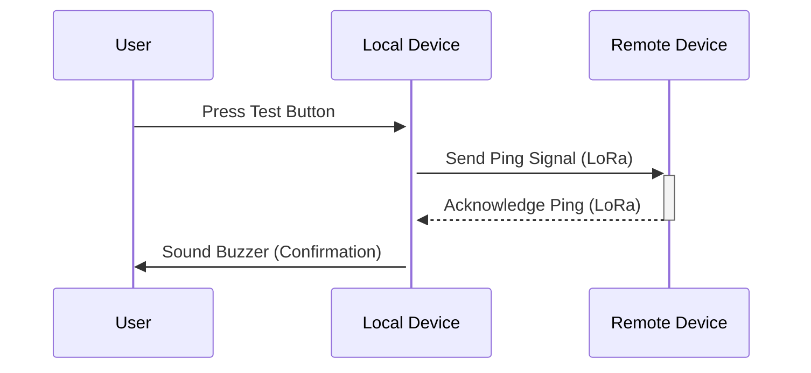
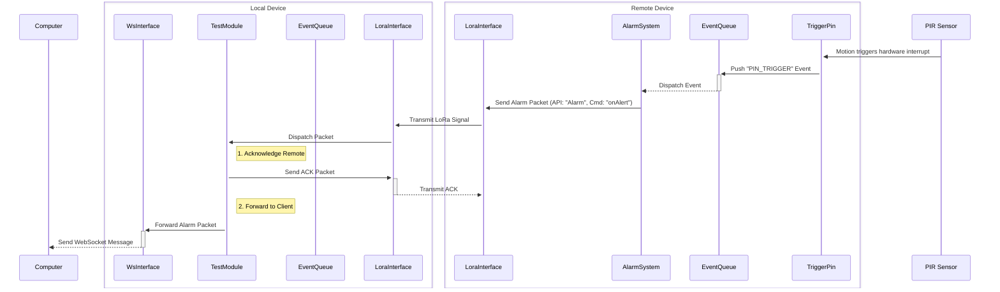
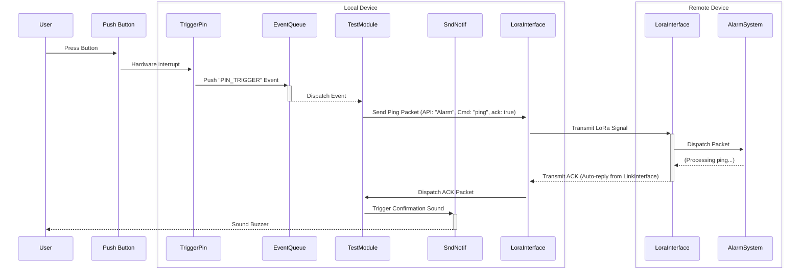
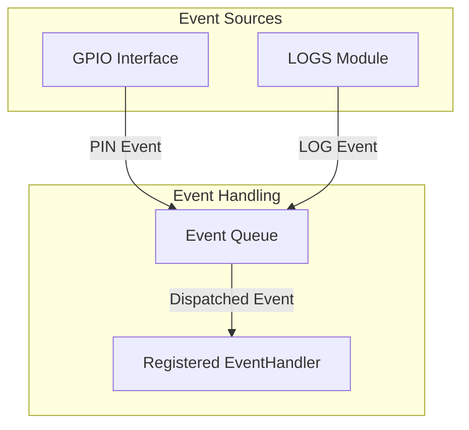
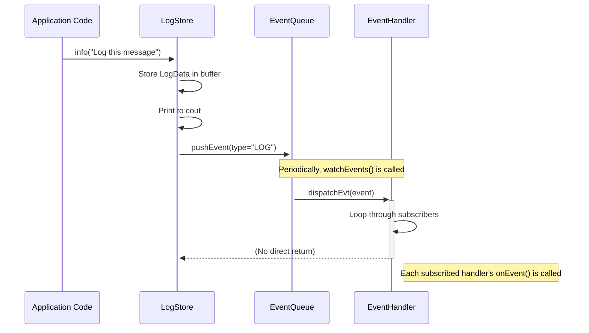
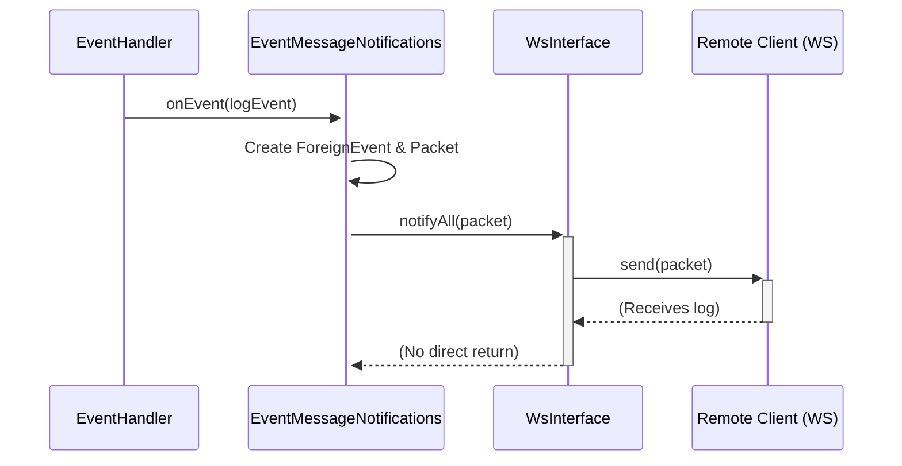
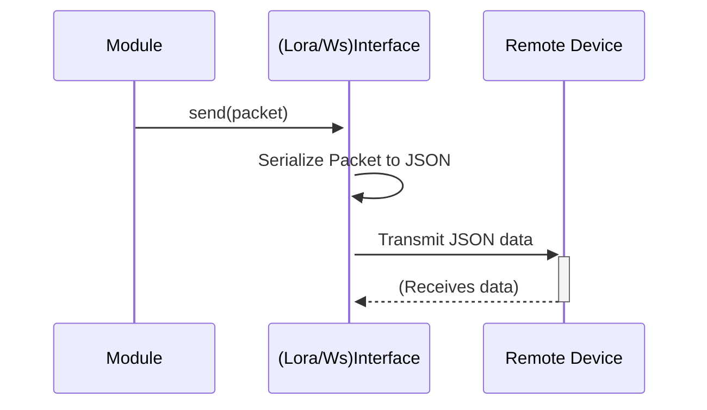

# System Architecture and Usecases

This document provides architectural diagrams and illustrates common usecases for the `esp32-toolkit-lib`.

## 1. Usecases

### 1.1. Use Case 1: Alarm Signal (Remote Device -> Local Device)

This diagram shows the sequence of events when the remote device's PIR sensor detects motion and sends an alarm to the local device, which then forwards it to a connected computer.



### 1.2. Use Case 2: Test/Ping Signal (Local Device -> Remote Device)

This diagram illustrates the user-initiated test signal from the local device to confirm the remote device is operational.



---

## 2. Detailed Interaction Diagrams

### 2.1. Detailed Alarm Signal Flow

This diagram provides a more detailed view of the internal components and events involved in the alarm signal use case.



### 2.2. Detailed Test/Ping Signal Flow

This diagram details the internal interactions for the user-initiated test signal.



---

## 3. Core System Interactions

These diagrams illustrate the fundamental interactions between core components of the `esp32-toolkit-lib`.

### 3.1. API Module Interaction with LinkInterface

***TODO***

### 3.2. Event System

This diagram illustrates the event handling mechanism, where events from sources like `GPIO` or `LOGS` are queued and then processed by registered event handlers.



### 3.3. Logs System

This section describes the logging mechanism in `esp32-toolkit-lib`.

When a log is initiated from the code (e.g., by calling `LogStore::info("My log message")`), the following sequence of events occurs:

1.  **Log Storage**:
    *   The `LogStore::add()` method is called.
    *   A `LogData` object is created, containing the log message, log level, and a timestamp.
    *   This `LogData` object is stored in the static `LogStore::logBuffer`.
    *   The log message is immediately printed to the standard output (`std::cout`).

2.  **Event Creation and Queuing**:
    *   An `Event` of type `LOG` is created.
    *   This `Event` is pushed into the `EventQueue::local` queue. Note: This step is skipped for debug-level logs (`LogStore::dbg()`) to avoid flooding the event system.

3.  **Event Dispatching**:
    *   The `EventQueue::watchEvents()` method, which is expected to be called periodically in the main application loop, dequeues the `LOG` event.
    *   It then calls `EventHandler::dispatchEvt()` with the event.

4.  **Event Handling**:
    *   `EventHandler::dispatchEvt()` iterates through all registered `EventHandler` instances.
    *   For each handler that is subscribed to the `LOG` event type (or all event types `*`), its `onEvent()` method is called.
    *   This allows different parts of the system to react to new log entries, for example, by forwarding them over a WebSocket connection, saving them to a file, or displaying them on a screen.

This entire process is illustrated in the following diagram:



#### 3.3.1. Logs Emitting (WebSocket)

When a log event needs to be sent to a remote client over a WebSocket connection, the `EventMessageNotifications` singleton comes into play. This class is an `EventHandler` subscribed to all event types.

The process for remote logging is as follows:

1.  **Event Handling**:
    *   The `EventMessageNotifications::onEvent()` method is called by the `EventHandler` dispatch mechanism when a `LOG` event is processed.

2.  **Packet Creation**:
    *   Inside `onEvent()`, a `ForeignEvent` object is created from the original `Event`.
    *   A `Packet` is constructed with the following properties:
        *   `api`: "notifier"
        *   `cmd`: "onForeignEvent"
        *   `data`: The serialized `ForeignEvent` object.

3.  **WebSocket Notification**:
    *   The serialized `Packet` is passed to `WsInterface::notifyAll()`.
    *   `WsInterface::notifyAll()` iterates through all connected WebSocket clients and sends the packet to each one.

4.  **Packet Format**:
    *   The final packet sent to the WebSocket client is a JSON object with the following structure. Note that the `data` field is a string containing a serialized JSON object.

    ```json
    {
      "id": "<packet_timestamp>",
      "src": "<device_id>",
      "endpoint": "notifier:onForeignEvent",
      "data": "{\"type\":\"LOG\",\"content\":\"<log_message>\",\"time\":<event_timestamp>,\"sender\":\"<device_id>\"}"
    }
    ```

This flow is illustrated in the diagram below:



## 4. Building blocks

### 4.1. Events system

This is to trigger actions internally

### 4.2. API modules

This is where all the processing logic happen consequently to emitted event or received paquet.

Example:
- logs monitoring: log event emitted => handled in specific module API to send paquet over ws
- GPIO control: paquet received => handled by GPIO remote service that will perform GPIO action

### 4.3. Communications (LoRa/WS)

This is the door to outside world

This section describes how data is exchanged over physical interfaces like LoRa or WebSockets. The `LinkInterface` class provides the core abstraction for these communication channels.

#### 4.3.1. Outgoing Packets

When a module needs to send data, it follows these steps:

1.  **Packet Creation**: An `ApiModule` (or any other component) creates a `Packet` object. This object contains:
    *   `api`: The target API on the remote device (e.g., "alarm").
    *   `cmd`: The command to execute (e.g., "onAlert").
    *   `data`: The payload, typically a serialized JSON object.
    *   `ack`: A boolean indicating if an acknowledgment is required.

2.  **Sending**: The `Packet` is passed to the `send()` method of a `LinkInterface` implementation (e.g., `LoraInterface` or `WsInterface`).

3.  **Serialization & Transmission**: The `LinkInterface` serializes the `Packet` into a JSON string and sends it over the physical medium (LoRa radio or WebSocket connection).



#### 4.3.2. Incoming Packets

When data is received from a physical interface, the `LinkInterface` handles it as follows:

1.  **Reception & Deserialization**: The `LinkInterface`'s internal task (or event handler) receives the raw data and parses it into a `Packet` object.

2.  **Acknowledgment (if required)**: If the received packet has the `ack` flag set to `true`, the `LinkInterface` automatically sends back an acknowledgment packet to the original sender.

3.  **Internal Dispatch**: The `Packet` is dispatched to the appropriate `ApiModule` based on the `api` field in the packet. The `LinkInterface` maintains a list of registered API handlers.

4.  **Command Execution**: The target `ApiModule` receives the packet and executes the command specified in the `cmd` field, using the provided `data`.

```mermaid
sequenceDiagram
    participant RemoteDevice as Remote Device
    participant LinkInterface as (Lora/Ws)Interface
    participant ApiModule as Registered ApiModule

    RemoteDevice->>+LinkInterface: (Sends JSON data)
    LinkInterface->>LinkInterface: Receive and Parse JSON to Packet
    Note over LinkInterface: If ack is required, send ACK back
    LinkInterface-->>RemoteDevice: ACK Packet
    LinkInterface->>+ApiModule: dispatch(packet)
    ApiModule->>ApiModule: Execute command from packet
    Api-Module-->>-LinkInterface: (No direct return)
```
